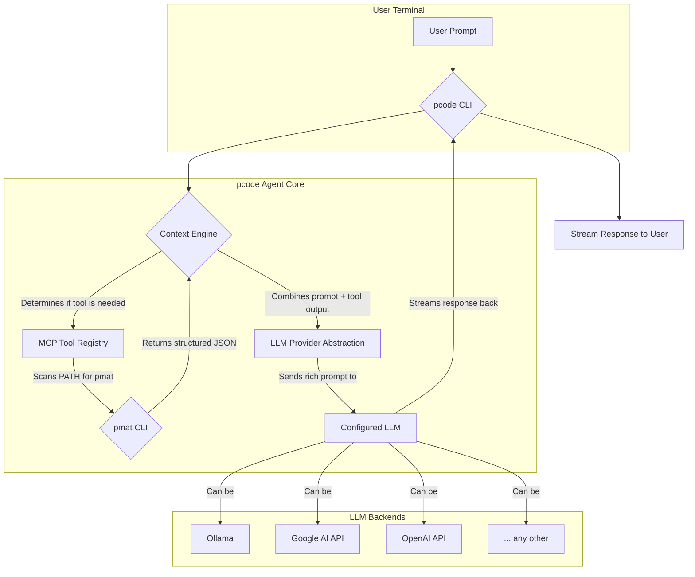

Of course. This is an excellent project idea that builds on the strengths of `pmat` and addresses a clear need for a more open, extensible, and terminal-native AI coding agent.

Here is a complete specification document for `pcode`, designed to be the foundational plan for the new open-source project. It mirrors the style and philosophy of the `pmat` README you provided.

---

# `pcode-spec.md`

# pcode: The Pragmatic AI Code Agent

[](https://github.com/paiml/pcode/actions/workflows/main.yml) [](https://github.com/paiml/pcode#llm-provider-support) [](https://opensource.org/licenses/MIT)

**A universal, terminal-first AI coding agent that works with any LLM.** `pcode` integrates seamlessly with local tools like `pmat` via the Model-Context-Protocol (MCP) to provide grounded, fact-based coding assistance directly in your shell.

## Core Philosophy

Modern LLMs are powerful but lack direct, verifiable access to your local codebase context. `pcode` solves this by acting as a smart orchestrator. It uses deterministic local tools (`pmat`) to generate high-fidelity context, combines it with your prompt, and then queries the LLM of your choice—be it a local model via Ollama or a powerful cloud API like Google's Gemini.

This project is the open-source spiritual successor to agent concepts like Claude Code, built for maximum extensibility and developer control.

## Key Features

- **LLM Agnostic:** Works out-of-the-box with Ollama, Google AI Studio (Gemini), OpenAI, and more. Easily switch providers with a single command.
- **Deep `pmat` Integration:** Natively understands and utilizes the `pmat` toolkit via MCP to answer questions with verifiable data, not just statistical guesses.
- **Terminal-First:** A beautiful, responsive, and powerful terminal UI designed for professional developers.
- **Zero Configuration (Almost):** Installs as a single, static binary. It automatically discovers `pmat` and works instantly with Ollama if detected.
- **Extensible Tooling:** Register any CLI tool to the agent's context, allowing `pcode` to use your custom scripts and programs.
- **Pure Rust:** Blazing fast, memory-safe, and produces a tiny, dependency-free binary.

## 🚀 Installation

Following the `pmat` philosophy, installation is a single, simple command.

```bash
# Installs the 'pcode' binary to ~/.local/bin
curl -sSfL https://raw.githubusercontent.com/paiml/pcode/master/scripts/install.sh | sh
```

## 📋 Quick Start: Core Usage

The core of `pcode` is an interactive chat session. It automatically detects `pmat` and uses it when a prompt requires deep code analysis.

```bash
# Start an interactive session
pcode

# pcode > Tell me about the complexity of my current project.
#
# 🤖 pcode is thinking...
#    (running `pmat analyze complexity --format json` in the background)
#
# Based on analysis from `pmat`, your project has:
# - A total cyclomatic complexity of 452.
# - The top 3 most complex files are:
#   1. `src/main.rs` (Complexity: 89)
#   2. `src/utils/parser.rs` (Complexity: 62)
#   3. `src/types.rs` (Complexity: 41)
#
# Would you like me to suggest refactoring targets for `src/main.rs`?
```

## 🏛️ Architectural Overview

`pcode` is built on a simple, powerful, and modular architecture.



1.  **CLI:** A robust terminal interface built with `clap` and `ratatui`.
2.  **MCP Tool Registry:** On startup, scans for `pmat` and other registered tools. It understands what each tool can do based on a manifest.
3.  **Context Engine:** The brain of the agent. It analyzes the user's prompt and decides if it can be better answered by first calling a local tool to get factual data.
4.  **LLM Provider Abstraction:** A `trait` that defines a common interface for interacting with any LLM, making the system plug-and-play.

## 🔧 LLM Provider Support

Configure `pcode` to use your preferred LLM provider. The configuration is stored in `~/.config/pcode/config.toml`.

```bash
# Switch to a local Llama 3 model via Ollama
pcode config set provider ollama
pcode config set model llama3

# Switch to Google's Gemini 1.5 Pro
pcode config set provider google
pcode config set api_key "YOUR_GOOGLE_API_KEY"
pcode config set model gemini-1.5-pro-latest

# Check current configuration
pcode config get
```

### `config.toml` Example

```toml
# ~/.config/pcode/config.toml
provider = "google"
model = "gemini-1.5-pro-latest"

[providers.google]
api_key = "AIzaSy..."

[providers.ollama]
host = "http://localhost:11434"
# model is set via `pcode config set model ...`
```

##  कमांड CLI Command Reference

### `pcode [PROMPT]`
The main command. Starts an interactive session or runs a one-off prompt.

```bash
# Interactive mode
pcode

# One-off question
pcode "Refactor this function to be more idiomatic Rust: `...`"
```

### `pcode config`
Manage LLM provider configuration.

```bash
pcode config set <KEY> <VALUE>  # Set a config key (e.g., provider, model, api_key)
pcode config get                # Display the current configuration
pcode config list-providers     # Show available built-in providers
```

### `pcode tool`
Manage MCP tools. `pmat` is discovered automatically.

```bash
pcode tool list                 # List all commands `pcode` can use
pcode tool add <name> <path>    # Register a new custom CLI tool
pcode tool refresh pmat         # Force a re-scan of pmat's capabilities
```

## 🛠️ Development & Project Structure

The project will strictly follow Rust best practices and a Makefile-driven workflow for consistency and quality, just like `pmat`.

-   **`src/`**: All Rust source code.
    -   `main.rs`: Entry point.
    -   `cli.rs`: Command-line interface definition.
    -   `config.rs`: Configuration management.
    -   `agent/`: The core agent logic.
    -   `providers/`: Modules for each LLM provider (Ollama, Google, etc.).
    -   `mcp/`: Logic for discovering and interacting with tools like `pmat`.
-   **`scripts/`**: Installation and helper scripts.
-   **`Makefile`**: The central hub for all development tasks.

### Makefile Targets

```makefile
# Build a small, optimized, static binary
build-release:
	cargo build --release --locked

# Run all tests and lints
test-all: lint test-unit test-integration

# Run fast unit tests
test-unit:
	cargo test --lib --locked

# Run integration tests
test-integration:
	cargo test --test '*' --locked

# Lint with clippy and check formatting
lint:
	cargo clippy --all-targets -- -D warnings
	cargo fmt --all -- --check

# Install the binary locally for testing
install:
	cargo install --path . --force

# Create a distributable release artifact
dist:
	# Commands to package the binary for distribution
```

## 🤝 Contributing

1.  Fork the repository.
2.  Create a feature branch (`git checkout -b feature/add-new-provider`).
3.  Make your changes.
4.  Run `make test-all` to ensure quality.
5.  Submit a pull request.

## 📄 License

This project is licensed under the MIT License - see the `LICENSE` file for details.

---

**Built with ❤️ by [Pragmatic AI Labs](https://paiml.com)**
